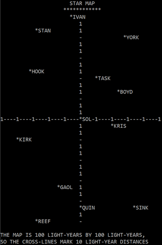

# Star Trader Python YANGP

Yet another NG project

This is currently a messy project. It all started with a fork from the sources
by true-grue (Peter Sovietov). The original Star Trader game was written by Dave
Kaufman in BASIC. Dave published informations about the game in "People's
Computer Company" newsletter in 1974. Later, the game code was printed in 1975,
in the wonderful book [What to Do After You Hit Return](https://archive.org/details/Whattodoafteryouhitreturn).
Back then, it was a time for *makers* so the book describes the mechanics behind
the game and ideas for improvement (we're comming back to this).

Based on those descriptions, true-grue made his implementation in Python. He did
a great job and the sources are nice to study. But his code was not much…
*Pythonic*. So my first intention was to refactor it.

In the process, I found myself really annoyed with this command line interface.
It was certainly great in 1974, but far away from today's expectations.

So, this project encouraged me to check the [Pygame](https://www.pygame.org)
project, and I decided to use it to learn basic features about Pygame.

## Current status
The main launcher should be the `start` module.

The working files is in the `st_run` module.

Currently, only the stars disply is working. Stars images are not part of the
sources as I didn't created the images.

### Original readme  

The following is taken from the original readme.

The original game was written by Dave Kaufman in BASIC and information about the game was published in "People's Computer Company" newsletter in 1974.
Here is a Python version of the game (work in progress, there could still be bugs!).

The game code was printed in 1975, in the wonderful book [What to Do After You Hit Return](https://archive.org/details/Whattodoafteryouhitreturn).
I think this book still has a huge education potential.
BASIC games from the book like "Star Trader" are quite complex.
They use lots of processes/algorithms/rules instead of data (graphics, audio, text -- it was a game designer Chris Crawford, who introduced the concept of process intensity in the games).
Still, it's possible with the help of the book to understand how "Star Trader" works and how to make your own, better version of the game.

